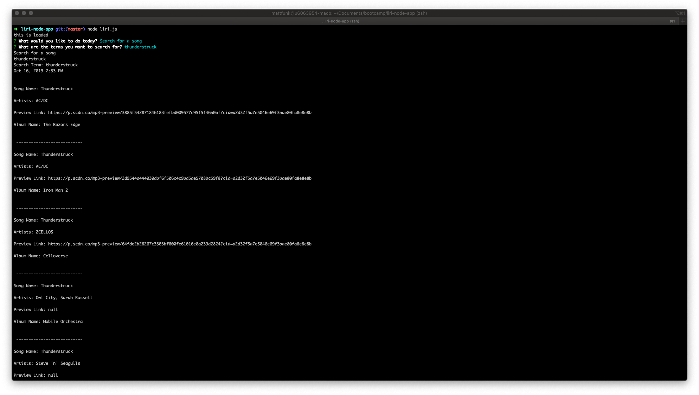

# Name
liri-node-app

# Description
This Liri bot utilizes the commandline interface so that the user can search for songs, concerts, movies, and even a little random surprise.

# Visuals
After entering the command "node liri.js" this question appears:
 

After a selection is made, this second question appears:
 

Once the answer is given and the user hits return, the results appear as follows:
 

# [Node](https://nodejs.org/en/) Packages Used
  - [axios](https://www.npmjs.com/package/axios)
  - [dotenv](https://www.npmjs.com/package/dotenv)
  - [inquirer](https://www.npmjs.com/package/inquirer)
  - [moment](https://www.npmjs.com/package/moment)
  - [node-spotify-api](https://www.npmjs.com/package/node-spotify-api)
  
# API's Used
  - [Bands In Town](https://rest.bandsintown.com)
  - [OMDB](http://www.omdbapi.com)
